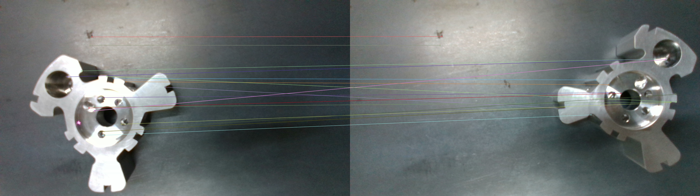
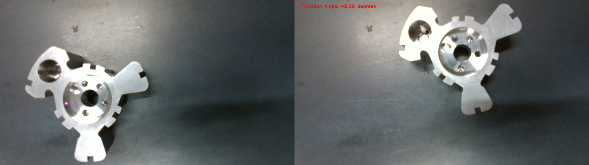
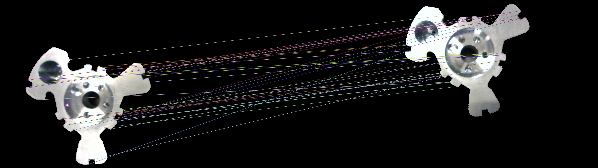
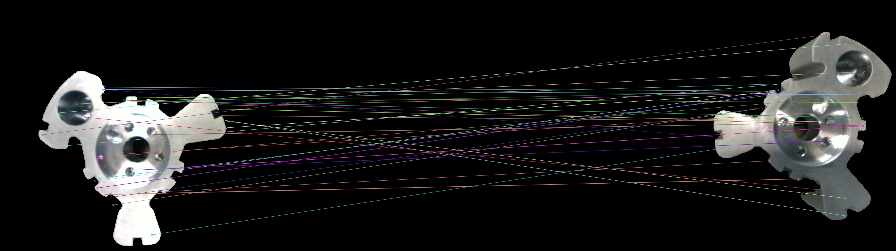

# ORIENTATION ESTIMATION
Given a set of template images and a corresponding set of test images for each template image, the objective is to find the relative orientation between a template image and a test image.

## DEPENDENCIES
1. cv2
2. numpy
3. torch
4. supervision==0.8.0
5. SAM. Follow the instructions in this [**link**](https://github.com/facebookresearch/segment-anything) to install dependencies and requirements of the model.

## SOLUTION 1
1. Used the regular ORB detector to detect key points and descriptors.
2. Brute force matcher to match key points and Lowe's ratio test to detect outliers.
3. Computed Homography matrix using the matched key points.
4. Decomposed homography matrix to get the planar rotation between the images.

  

## PROBLEMS WITH SOLUTION 1
As can be seen from the image, the key points selected are not only on the object of interest but also in the background. This leads to unnecessary noise and improper matches.

  

Despite having almost no rotation, we get 48 degrees as a result.

## STEPS TO RUN SOLUTION 1
Clone the repo and run **python find_rot_soln0.py**

## SOLUTION 2  
1. Used the Segment Anything Model (SAM) to mask out the background.

  

As can be seen in this image, the key points are now much better, with focus primarily on the object of interest.

## PROBLEMS WITH SOLUTION 2
Still, some matches are not accurate, with wrong correspondences.

## STEPS TO RUN SOLUTION 2
The masked images are already generated and placed in the corresponding folder. If necessary, you can run the segmentation model again. Clone the SAM repo and place the segmentation.py file in the segment-anything folder. Do not forget to download the
default model_checkpoint(vit_h) for the SAM model, as instructed. Update the template_folder and  test_folder locations accordingly and run **python find _rot_soln1.py** 

## SOLUTION 3
1. Used the Segment Anything Model along with the SIFT Operator and also some harsher quantity of match constraint (min 10).

  

As can be seen in image we get a much better solution and the matches are also really good.

## STEPS TO RUN SOLUTION 3
Similar to SOLUTION 2

## FUTURE WORK
These solutions still do not account for inward and outward rotations as can be seen in these results. 
This can be improved using deep learning models to detect 6D pose and extracting rotation angles from them.

